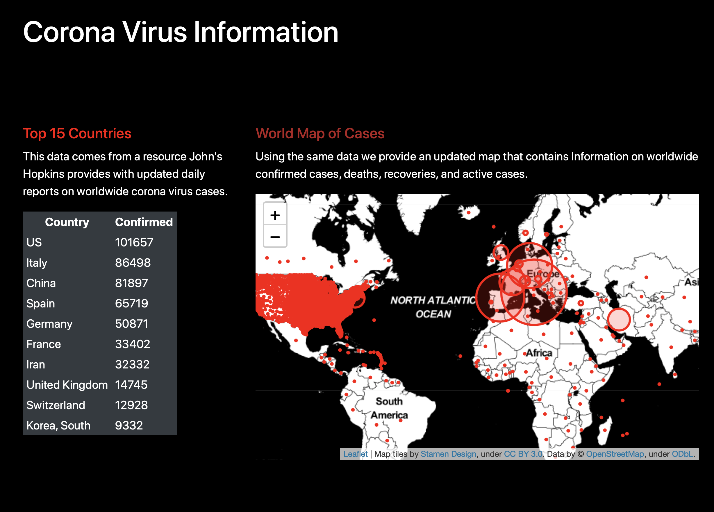

### Coronavirus Flask Application

To run this application locally, please be sure you have the `app.py` file as well as the `static` and `templates` folders in the same directory.  From your terminal in the same working directory run `python app.py` and you should have the site live at [`http://127.0.0.1:5000`](http://127.0.0.1:5000). You should see something similar to the image below if all is successful.

- [YouTube Video Tutorials](https://www.youtube.com/playlist?list=PLUCTTwyv9AdUQPb6ti9FVX9fmH-mXYkAO)

- [Google Colab Notebook](https://colab.research.google.com/drive/191Q_4zQrkklY_u4ist-ALjar8ukcwA3g).  We used this notebook to develop the table and map in application below.  It is also available as a notebook named [covid_activity_I.ipynb](covid_activity_I.ipynb) in this same folder.

