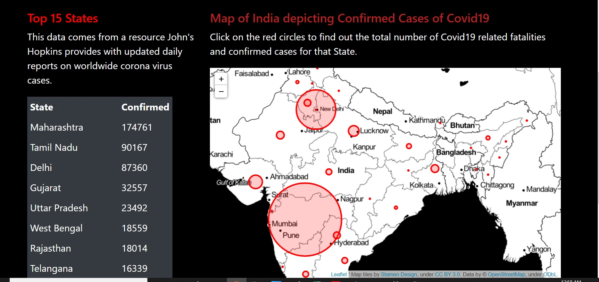

### Coronavirus India App

This repository consists of files required to deploy a Web App created with Flask on Heroku platform.

• If you want to view the deployed model, click on the following link:
Deployed at: https://india-covid19-cases.herokuapp.com/

• A glimpse of the web app:

Credit:
The code used in this repository is a derivative work of the code from https://github.com/jfkoehler/Teaching-with-COVID
